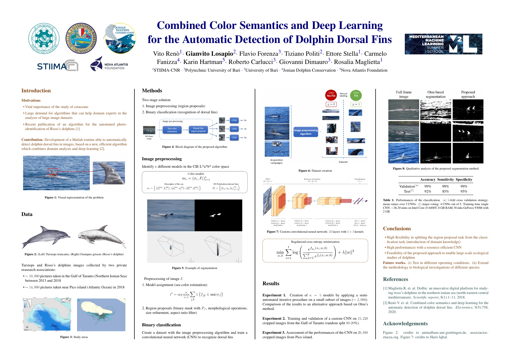

  

    <iframe src="https://player.vimeo.com/video/409803115?loop=1&autoplay=1&background=1&title=0&byline=0&portrait=0" frameborder="0" allowfullscreen
      style="position:absolute;top:0;left:0;width:100%;height:100%;"></iframe>
  

  

  

<b>Poster:</b> 
<a href="./poster.pdf">PDF</a>

<!--
 <iframe
       src="poster.pdf"
       width="100%"
       height="450px"
       style="border:none;">
 </iframe> 
-->

<b>Demo</b>  (suggested visualization from Desktop):
<a href="https://nbviewer.jupyter.org/github/gvlos/academic-kickstart/blob/master/content/publication/journal-article/demo.html">Webpage</a>

<!--
 
 
 <iframe
       src="https://nbviewer.jupyter.org/github/gvlos/academic-kickstart/blob/master/content/publication/journal-article/demo.html"
       width="100%"
       height="1000px"
       style="border:none;">
 </iframe>
-->

<b>Publication:</b> 
<a href="https://doi.org/10.3390/electronics9050758">https://doi.org/10.3390/electronics9050758</a>

<b>Video credits:</b> 
<a href="https://www.joniandolphin.it/wordpress/2017/?lang=en">Jonian Dolphin Conservation</a>